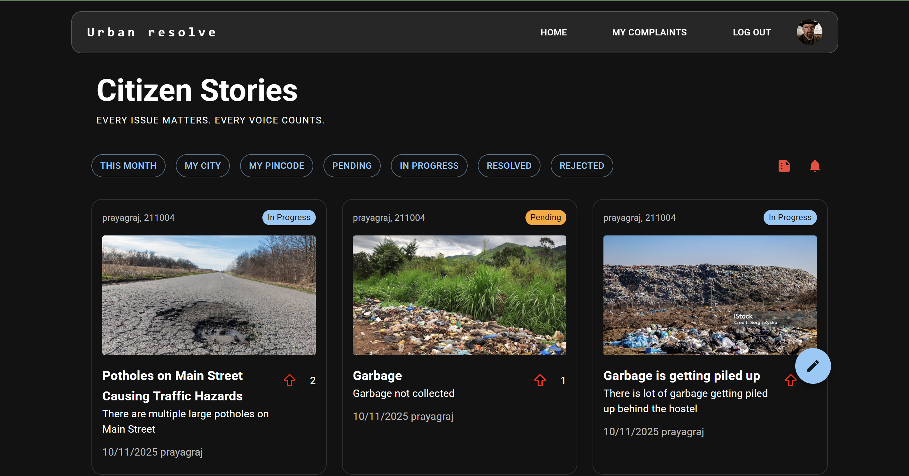
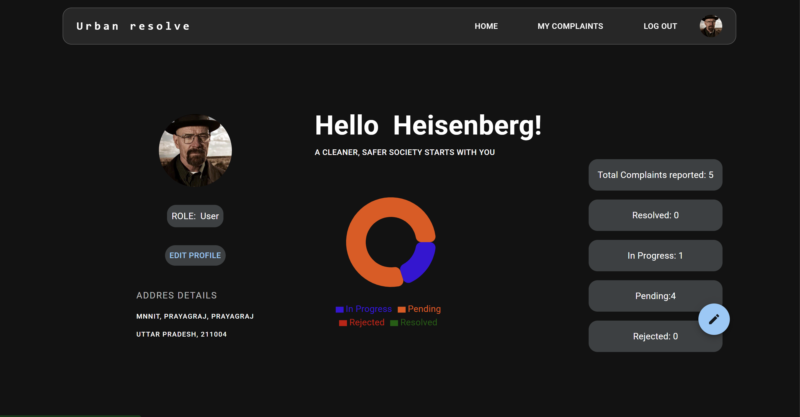

 <a id="readme-top"></a>

<div align="center">

[](https://github.com/abhiishhekk/Complaint_Tracking_System/graphs/contributors)&nbsp;[](https://github.com/abhiishhekk/Complaint_Tracking_System/network/members)&nbsp;[](https://github.com/abhiishhekk/Complaint_Tracking_System/stargazers)&nbsp;[](https://github.com/abhiishhekk/Complaint_Tracking_System/issues)&nbsp;[](https://github.com/abhiishhekk/Complaint_Tracking_System/blob/main/LICENSE.txt)&nbsp;

</div>
<br />
<div align="center">
  <a href="https://github.com/abhiishhekk/Complaint_Tracking_System">
    
  </a>

<h3 align="center">Urban Resolve © 2025</h3>
  <p align="center">
    A comprehensive municipal complaint management platform for citizens and municipal authorities.

    <br />
    <br />
    <a href="https://urban-resolve-client.onrender.com/" ><strong style="text-decoration: underline; color: #0366d6;">View Demo »</strong></a>
    <br />
    <a href="https://github.com/abhiishhekk/Complaint_Tracking_System/issues" style="text-decoration: underline; color: #0366d6;">Report Bug</a>
    ·
    <a href="https://github.com/abhiishhekk/Complaint_Tracking_System/issues" style="text-decoration: underline; color: #0366d6;">Request Feature</a>
  </p>
</div>


<details class="toc">
  <summary>Table of Contents</summary>
  <ol>
    <li>
      <a href="#about-the-project">About The Project</a>
      <ul>
        <li><a href="#built-with">Built With</a></li>
      </ul>
    </li>
    <li><a href="#-screenshots--demo">Screenshots & Demo</a></li>
    <li>
      <a href="#getting-started">Getting Started</a>
      <ul>
        <li><a href="#prerequisites">Prerequisites</a></li>
        <li><a href="#installation">Installation</a></li>
      </ul>
    </li>
    <li><a href="#usage">Usage</a></li>
    <li><a href="#roadmap">Roadmap</a></li>
    <li><a href="#contributing">Contributing</a></li>
    <li><a href="#license">License</a></li>
    <li><a href="#contact">Contact</a></li>
  </ol>
</details>

---

## About The Project

**Urban Resolve** is a next-generation municipal complaint management platform that bridges the gap between citizens and civic authorities. Built with modern web technologies, it provides a seamless, transparent, and efficient system for reporting, tracking, and resolving urban infrastructure issues. Whether it's a pothole on your street, a water supply problem, or a garbage collection concern, Urban Resolve ensures every voice is heard and every issue is addressed.

The platform features intelligent dashboards for different user roles, real-time notifications, advanced filtering and analytics, and a comprehensive audit trail for complete transparency in municipal governance.

---

## ✨ Key Features

### 🎯 **For Citizens**

* **Easy Complaint Registration**
  - File complaints with detailed categorization (Road, Water, Electricity, Garbage, and more)
  - Attach high-quality images as evidence via Cloudinary integration
  - Set urgency levels (Low, Medium, High, Critical) to prioritize issues
  - Provide precise location details with pincode, city, and state

* **Real-Time Complaint Tracking**
  - Monitor complaint status through intuitive dashboard
  - Track progress from submission to resolution
  - View detailed complaint history with timestamps
  - Receive instant notifications for status updates

* **Community Engagement**
  - Upvote existing complaints to show community support
  - View trending issues in your locality
  - Browse public complaint feed with smart filters

* **Profile Management**
  - Update personal information and contact details
  - View complaint statistics and contribution history
  - Manage notification preferences

### 👮 **For Municipal Staff**

* **Assigned Complaint Management**
  - Dedicated dashboard showing all assigned complaints
  - Filter complaints by status, urgency, and date
  - Update complaint progress with status changes
  - Add internal notes and updates

* **Resolution Request System**
  - Submit resolution requests with proof of completion
  - Upload before/after images as evidence
  - Add detailed resolution descriptions
  - Track approval status from admins

* **Workload Overview**
  - View personal performance statistics
  - Monitor average resolution time
  - Track pending and completed tasks

### 👨‍💼 **For Administrators**

* **Advanced User Management**
  - View and manage all registered users
  - Filter users by role, state, district, and pincode
  - Search users by email with real-time results
  - Assign and modify user roles (Citizen, Staff, Admin)
  - View detailed user profiles with activity statistics

* **Complaint Assignment System**
  - Assign complaints to appropriate staff members
  - Filter staff by location and workload
  - Smart staff suggestions based on:
    - Geographic proximity to complaint
    - Current workload
    - Average resolution time
    - Performance metrics

* **Resolution Review Center**
  - Review staff resolution requests
  - Approve or reject with feedback
  - View resolution proof and evidence
  - Ensure quality control before marking resolved

* **Comprehensive Analytics Dashboard**
  - View system-wide statistics and trends
  - Monitor complaint distribution by:
    - Status (Pending, In Progress, Resolved, Rejected)
    - Type (Road, Water, Electricity, Garbage, Other)
    - Geographic location (State, District, City, Pincode)
    - Time period (Daily, Monthly, Yearly trends)
  - Track staff performance metrics
  - Identify problem areas requiring attention

* **PDF Report Generation**
  - Generate detailed locality-based reports
  - Filter reports by state and pincode
  - Export complaint statistics with visualizations
  - Include complaint breakdowns by type and status
  - Automatic timestamping for record-keeping

### 🔐 **Security & Authentication**

* **Secure User Authentication**
  - JWT-based authentication with access and refresh tokens
  - Secure password hashing with bcrypt
  - Email verification for new accounts
  - Password reset functionality with secure tokens
  - Rate limiting on sensitive endpoints

* **Role-Based Access Control (RBAC)**
  - Three distinct user roles: Citizen, Staff, Admin
  - Protected routes based on user permissions
  - Granular access control for different features

### 🔔 **Smart Notification System**

* **Real-Time Alerts**
  - Instant notifications for complaint status changes
  - Assignment notifications for staff
  - Resolution approval/rejection alerts
  - Automated email notifications via SendGrid
  - In-app notification center with read/unread status
  - Mark notifications as read/unread
  - Notification history and tracking

### 📊 **Advanced Filtering & Search**

* **Multi-Parameter Filters**
  - Filter complaints by status, urgency, and type
  - Location-based filtering (State, City, Pincode, Locality)
  - Date range selection with "This Month" quick filter
  - "My City" and "My Pincode" personalized filters
  - Combine multiple filters for precise results

* **Smart Search**
  - Search complaints by title and description
  - Real-time search results
  - Debounced search for optimal performance

### 📈 **Public Statistics & Transparency**

* **Landing Page Analytics**
  - Live complaint statistics visible to all visitors
  - User registration and engagement metrics
  - Geographic distribution of complaints
  - Resolution success rates
  - Build trust through transparency

### 🎨 **Modern User Experience**

* **Responsive Design**
  - Fully responsive across desktop, tablet, and mobile
  - Material-UI components for consistent design
  - Dark/Light theme support
  - Smooth animations and transitions

* **Interactive Features**
  - Marquee showcase of platform features
  - Interactive complaint cards with detailed views
  - Modal dialogs for detailed information
  - Loading states and error handling
  - Toast notifications for user feedback

### 🚀 **Performance & Scalability**

* **Optimized Architecture**
  - RESTful API design with Express.js
  - MongoDB aggregation for complex queries
  - Efficient caching strategies
  - Pagination for large datasets
  - Image optimization via Cloudinary
  - Rate limiting to prevent abuse

<p align="right">(<a href="#readme-top">back to top</a>)</p>

### Built With

This project leverages a powerful and modern technology stack for optimal performance and scalability.

**Frontend:**
* [![React][React.js]][React-url] - UI library for building interactive interfaces
* [](https://mui.com/) - Component library for elegant design
* [](https://vitejs.dev/) - Lightning-fast build tool
* **React Router** - Client-side routing
* **Axios** - HTTP client for API requests

**Backend:**
* [![Node][Node.js]][Node-url] - JavaScript runtime environment
* [![Express][Express.js]][Express-url] - Fast, minimalist web framework
* [![MongoDB][MongoDB]][Mongo-url] - NoSQL database for flexible data storage
* **Mongoose** - MongoDB object modeling
* **JWT** - Secure authentication with JSON Web Tokens
* **Bcrypt** - Password hashing for security

**External Services:**
* **Cloudinary** - Cloud-based image and media management
* **SendGrid** - Reliable email delivery service
* **Railway/Render** - Cloud hosting and deployment

<p align="right">(<a href="#readme-top">back to top</a>)</p>

---

## 📸 Screenshots & Demo

### Screenshots

<div align="center">

#### 📊 Dashboard
*Comprehensive dashboard with recent complaints and quick actions*



#### 👤 User Profile
*Personalized profile page with statistics and settings*



#### 🔍 Complaint Details
*Detailed complaint view with full information and history*


#### 🎯 Admin Management
*Powerful admin dashboard for system oversight*


#### 👥 User Profile Card
*Admin view for managing user roles and statistics*


</div>

### Video Demo

[](https://youtu.be/kMk5US-CRag)

<p align="right">(<a href="#readme-top">back to top</a>)</p>

---

## Getting Started

Follow these steps to set up Urban Resolve on your local machine for development and testing.

### Prerequisites

Ensure you have the following installed:

* **Node.js** (v18.x or later) - [Download here](https://nodejs.org/)
* **npm** (comes with Node.js)
    ```sh
    npm install npm@latest -g
    ```
* **MongoDB** - Local installation or [MongoDB Atlas](https://www.mongodb.com/cloud/atlas) cloud database
* **Git** - For cloning the repository

### Installation

#### 1. Clone the Repository
```sh
git clone https://github.com/abhiishhekk/Complaint_Tracking_System.git
cd Complaint_Tracking_System
```

#### 2. Backend Setup

Navigate to the backend directory:
```sh
cd backend
```

Install dependencies:
```sh
npm install
```

Create a `.env` file in the `backend` directory with the following configuration:

```env
# Server Configuration
NODE_ENV=development
PORT=8000

# Database
MONGODB_URI=your_mongodb_connection_string

# JWT Secrets (use strong, random strings)
ACCESS_JWT_TOKEN_SECRET=your_super_secret_access_token_min_32_chars
REFRESH_JWT_TOKEN_SECRET=your_super_secret_refresh_token_min_32_chars

# Token Expiry
ACCESS_JWT_TOKEN_EXPIRY=15m
REFRESH_JWT_TOKEN_EXPIRY=7d

# Cookie Settings
COOKIE_SECURE=false
COOKIE_SAMESITE=lax

# URLs
FRONTEND_URL=http://localhost:5173
BACKEND_URL=http://localhost:8000

# Email Service (SendGrid)
SENDGRID_API_KEY=your_sendgrid_api_key
EMAIL_FROM=noreply@urbanresolve.com

# Cloudinary (Image Storage)
CLOUDINARY_CLOUD_NAME=your_cloudinary_cloud_name
CLOUDINARY_API_KEY=your_cloudinary_api_key
CLOUDINARY_API_SECRET=your_cloudinary_api_secret
```

**Getting API Keys:**
- **MongoDB**: Create a free cluster at [MongoDB Atlas](https://www.mongodb.com/cloud/atlas)
- **SendGrid**: Sign up at [SendGrid](https://sendgrid.com/) for email service
- **Cloudinary**: Register at [Cloudinary](https://cloudinary.com/) for image hosting

#### 3. Frontend Setup

Navigate to the frontend directory:
```sh
cd ../client
```

Install dependencies:
```sh
npm install
```

Create a `.env` file in the `client` directory:

```env
VITE_API_BASE_URL=http://localhost:8000/api/v1
```

#### 4. Database Seeding (Optional)

To populate the database with sample data for testing:

```sh
cd backend
node scripts/seed.js
```

This will create sample users, complaints, and notifications.

#### 5. Run the Application

**Start the backend server:**
```sh
cd backend
npm run dev
```
The backend API will be available at `http://localhost:8000`

**Start the frontend development server (in a new terminal):**
```sh
cd client
npm run dev
```
The frontend will be available at `http://localhost:5173`

#### 6. Access the Application

Open your browser and navigate to:
- **Frontend**: `http://localhost:5173`
- **Backend API**: `http://localhost:8000/api/v1`

**Default Test Credentials (if using seed data):**
- **Admin**: admin@test.com / password123
- **Staff**: staff@test.com / password123
- **Citizen**: citizen@test.com / password123

---

<p align="right">(<a href="#readme-top">back to top</a>)</p>


<p align="right">(<a href="#readme-top">back to top</a>)</p>

---

## Usage

Urban Resolve provides different experiences based on user roles. Here's how to use the platform:

### 🎭 User Roles & Capabilities

#### **Citizens** 👥
1. **Register & Login**
   - Create a new account with email verification
   - Login with secure JWT authentication
   - Reset password if forgotten

2. **File Complaints**
   - Click the floating action button (FAB) or "Register Complaint"
   - Fill in complaint details:
     - Title and description
     - Type (Road, Water, Electricity, Garbage, Other)
     - Urgency level (Low, Medium, High, Critical)
     - Location (Pincode, City, State, Locality)
   - Upload supporting images (up to 5MB)
   - Submit and receive confirmation

3. **Track Complaints**
   - View all your complaints in "My Complaints"
   - Monitor real-time status updates
   - Filter by status, date, and urgency
   - View detailed complaint information
   - Upvote other complaints to show support

4. **Stay Informed**
   - Receive email notifications for status changes
   - Check in-app notification center
   - View complaint analytics and trends

#### **Municipal Staff** 👷
1. **Dashboard Access**
   - View all assigned complaints
   - See pending tasks and priorities
   - Monitor personal performance metrics

2. **Manage Complaints**
   - Update complaint status (In Progress)
   - Add internal notes and updates
   - Filter and search assigned tasks

3. **Submit Resolutions**
   - Navigate to complaint details
   - Click "Request Resolution"
   - Upload proof of work (before/after images)
   - Add resolution description
   - Submit for admin approval

4. **Track Performance**
   - View resolution statistics
   - Monitor average resolution time
   - See completed vs pending tasks

#### **Administrators** 👨‍💼
1. **System Overview**
   - Access comprehensive analytics dashboard
   - View system-wide statistics
   - Monitor complaint trends by:
     - Geographic location
     - Complaint types
     - Status distribution
     - Monthly patterns

2. **User Management**
   - Navigate to "Management" → "User Management"
   - Search and filter users
   - View user profiles and statistics
   - Assign/modify user roles
   - Monitor user activity

3. **Complaint Assignment**
   - View unassigned complaints
   - Browse staff by location and workload
   - Assign complaints to appropriate staff
   - Use smart suggestions for optimal assignment

4. **Resolution Review**
   - Navigate to "Management" → "Resolution Center"
   - Review staff resolution requests
   - View proof and evidence
   - Approve or reject with feedback
   - Ensure quality control

5. **Generate Reports**
   - Access report generation tool
   - Filter by state and pincode
   - Download comprehensive PDF reports
   - Share with stakeholders

### 📱 Common Features

**Filtering & Search:**
- Use the filter bar to narrow down results
- Apply multiple filters simultaneously
- Quick filters: "This Month", "My City", "My Pincode"
- Search by title or description

**Notifications:**
- Bell icon shows unread notification count
- Click to view notification center
- Mark notifications as read/unread
- Automatic email alerts for important updates

**Profile Management:**
- Click profile icon in navigation
- Update personal information
- View complaint/resolution statistics
- Manage account settings

**Theme Toggle:**
- Click sun/moon icon to switch themes
- Preference saved across sessions

### 🎯 Best Practices

**For Citizens:**
- Provide clear, detailed descriptions
- Upload high-quality images as evidence
- Set appropriate urgency levels
- Check existing complaints before filing duplicates

**For Staff:**
- Update complaint status regularly
- Add clear resolution descriptions
- Upload proof of completed work
- Maintain communication with citizens

**For Admins:**
- Review resolutions promptly
- Assign complaints based on expertise and workload
- Monitor system trends for proactive management
- Generate regular reports for stakeholders


<p align="right">(<a href="#readme-top">back to top</a>)</p>

---

## 🤝 Contributing

Contributions make the open-source community an incredible place to learn, innovate, and create. Your contributions are **greatly appreciated**!

### How to Contribute

1. **Fork the Project**
   ```sh
   git clone https://github.com/your-username/Complaint_Tracking_System.git
   ```

2. **Create a Feature Branch**
   ```sh
   git checkout -b feature/AmazingFeature
   ```

3. **Make Your Changes**
   - Write clean, documented code
   - Follow existing code style
   - Test your changes thoroughly

4. **Commit Your Changes**
   ```sh
   git commit -m 'Add some AmazingFeature'
   ```

5. **Push to Your Branch**
   ```sh
   git push origin feature/AmazingFeature
   ```

6. **Open a Pull Request**
   - Provide a clear description of changes
   - Reference any related issues
   - Wait for code review

### Contribution Guidelines

- Ensure code follows project conventions
- Update documentation for new features
- Add tests for new functionality
- Keep pull requests focused and atomic
- Be respectful in all interactions

### Found a Bug?

Open an issue with the tag "bug" and include:
- Detailed description
- Steps to reproduce
- Expected vs actual behavior
- Screenshots if applicable
- Environment details

### Have a Feature Idea?

Open an issue with the tag "enhancement" and describe:
- The problem it solves
- Proposed solution
- Alternative approaches considered
- Any mockups or examples

**Don't forget to give the project a star! ⭐**

<p align="right">(<a href="#readme-top">back to top</a>)</p>

---

## 📄 License

Distributed under the MIT License. See [`LICENSE.txt`](LICENSE.txt) for more information.

The MIT License allows you to:
- ✅ Use commercially
- ✅ Modify
- ✅ Distribute
- ✅ Private use

<p align="right">(<a href="#readme-top">back to top</a>)</p>

---

## 📧 Contact

**Project Maintainer:** Abhishek Kumar

**Email:** application.controllerroute@gmail.com

**Project Link:** [https://github.com/abhiishhekk/Complaint_Tracking_System](https://github.com/abhiishhekk/Complaint_Tracking_System)

**Live Demo:** [https://urban-resolve-client.onrender.com/](https://urban-resolve-client.onrender.com/)

### Connect With Us

Feel free to reach out for:
- 🐛 Bug reports
- 💡 Feature requests
- 🤝 Collaboration opportunities
- ❓ Questions and support

<p align="right">(<a href="#readme-top">back to top</a>)</p>

---

## 🙏 Acknowledgments

Special thanks to:

* [MongoDB](https://www.mongodb.com/) - For the robust NoSQL database
* [Cloudinary](https://cloudinary.com/) - For seamless image management
* [SendGrid](https://sendgrid.com/) - For reliable email delivery
* [Material-UI](https://mui.com/) - For beautiful React components
* [React Router](https://reactrouter.com/) - For smooth navigation
* [Render](https://render.com/) / [Railway](https://railway.app/) - For hosting services
* All contributors who have helped improve this project

<p align="right">(<a href="#readme-top">back to top</a>)</p>

---

## 📊 Project Stats


---

<div align="center">

**Made with ❤️ for better civic governance**

*Empowering citizens, enabling authorities, transforming communities*

</div>

[React.js]: https://img.shields.io/badge/React-20232A?style=for-the-badge&logo=react&logoColor=61DAFB
[React-url]: https://reactjs.org/
[Node.js]: https://img.shields.io/badge/Node.js-339933?style=for-the-badge&logo=nodedotjs&logoColor=white
[Node-url]: https://nodejs.org/
[Express.js]: https://img.shields.io/badge/Express.js-000000?style=for-the-badge&logo=express&logoColor=white
[Express-url]: https://expressjs.com/
[MongoDB]: https://img.shields.io/badge/MongoDB-47A248?style=for-the-badge&logo=mongodb&logoColor=white
[Mongo-url]: https://www.mongodb.com/
[TailwindCSS]: https://img.shields.io/badge/Tailwind_CSS-06B6D4?style=for-the-badge&logo=tailwindcss&logoColor=white
[TailwindCSS-url]: https://tailwindcss.com/
